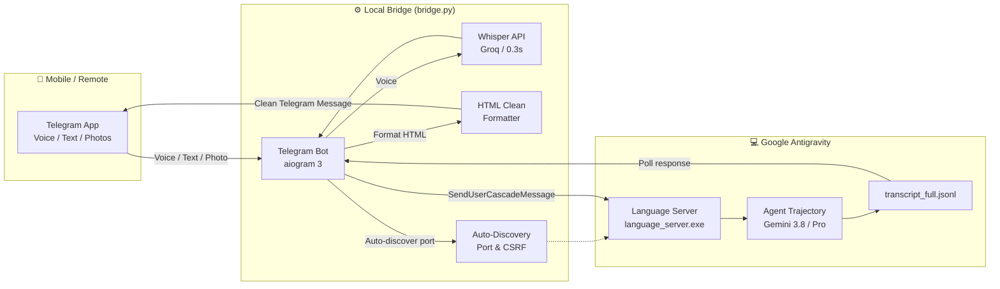

# 🚀 Antigravity Telegram Bridge

<p align="center">
  <b>Remote-control your active Google Antigravity IDE session from Telegram via Voice, Text, Photos, and Documents.</b>
</p>

<p align="center">
  
  
  
  
</p>

---

[English](#features) | [Русский](#особенности-на-русском)

---

## Features

- 🎙 **Instant Voice Coding (Whisper)**: Dictate prompts on the go from taxi, gym, or walking. Voice messages are transcribed in **0.3s** via Groq Whisper-large-v3.
- 📸 **Multimodal Vision**: Send photos, drawings, schematics, or error screenshots from your phone camera. Antigravity's vision model analyzes them immediately.
- ⚡ **Direct IDE Injection**: Communicates directly with the live Antigravity `language_server.exe` through internal Connect-RPC (`SendUserCascadeMessage`). Your messages appear in the IDE chat in real time!
- 🔄 **Auto-Discovery**: Automatically discovers dynamic ports and CSRF tokens across Antigravity restarts. Zero maintenance needed.
- 🧼 **Clean Formatting**: Strips raw Markdown debris (`###`, `---`, `**`, `<kbd>`) and formats responses into clean, beautiful Telegram messages.
- ☕ **Built-in Keep-Awake**: Native Windows `SetThreadExecutionState` prevents your PC from falling asleep while Antigravity is minimized.

---

## Architecture



---

## Quick Start (3 Steps)

### 1. Clone & Install
```bash
git clone https://github.com/kamil8819/antigravity-telegram-bridge.git
cd antigravity-telegram-bridge
pip install -r requirements.txt
```

### 2. Configure Credentials
Copy the example environment file:
```bash
copy .env.example .env
```
Edit `.env` and provide your keys:
- `TELEGRAM_BOT_TOKEN`: Create a bot in [@BotFather](https://t.me/BotFather) and paste the token.
- `GROQ_API_KEY`: *(Optional but recommended)* Free API key from [console.groq.com](https://console.groq.com) for 0.3s voice transcription.

### 3. Run
Double-click **`start.bat`** or execute:
```bash
python bridge.py
```

Open your Telegram bot on your phone, click **`/start`**, and send your first voice or text command!

---

## Особенности (на русском)

- **Голосовое управление на ходу**: надиктовывайте задачи голосом из такси или спортзала — бот расшифровывает их через Whisper за доли секунды и передает агенту на компьютере.
- **Анализ фото и чертежей**: отправьте фото детали, мебели, схемы или снимок экрана с ошибкой — агент изучит изображение через компьютерное зрение.
- **Прямое подключение к IDE**: в отличие от сторонних ботов, этот мост подключается к **уже открытому диалогу Antigravity** через внутренний протокол `SendUserCascadeMessage`.
- **Автоопределение портов**: при перезапуске Antigravity скрипт сам находит новый порт и CSRF-токен ядра — связь не теряется.
- **Красивый диалог**: никаких сырых решеток `###` и звездочек `**` — сообщения форматируются в аккуратный человеческий стиль для мессенджера.
- **Защита от сна**: компьютер не уснет при свернутом окне благодаря вызову Windows API `SetThreadExecutionState`.

---

## Author & License

Developed with ❤️ by **Kamil Zalyaleev**.  
Released under the [MIT License](LICENSE).
